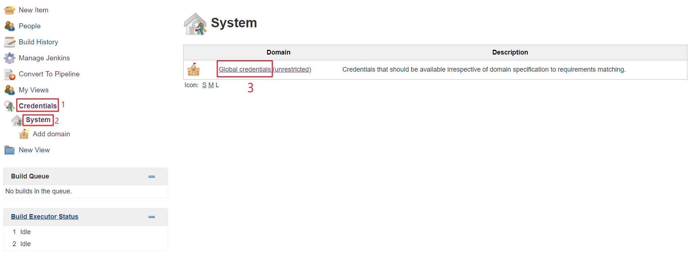
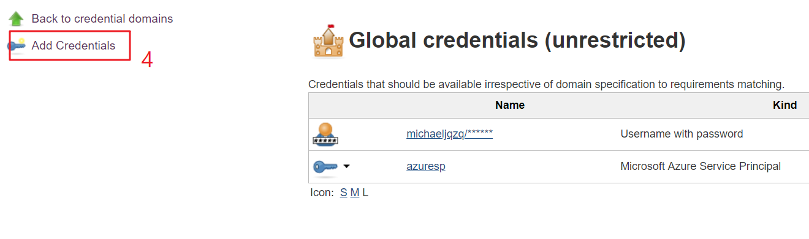
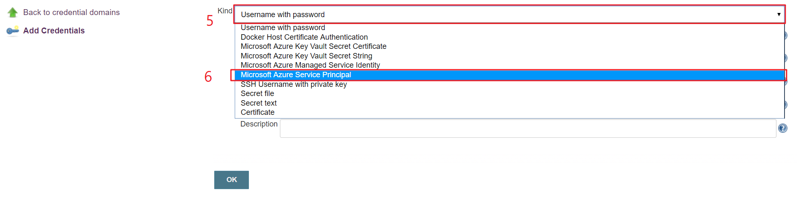
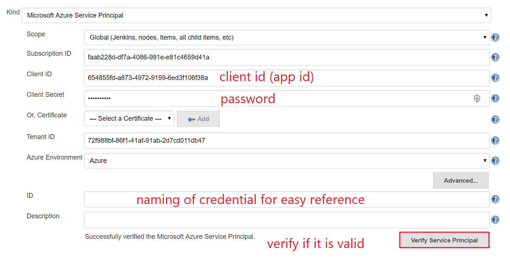
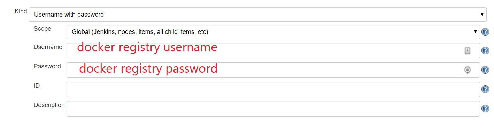
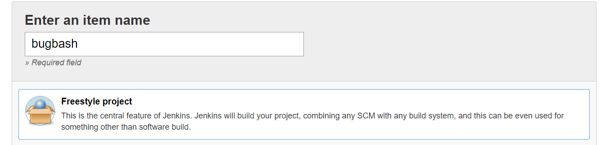
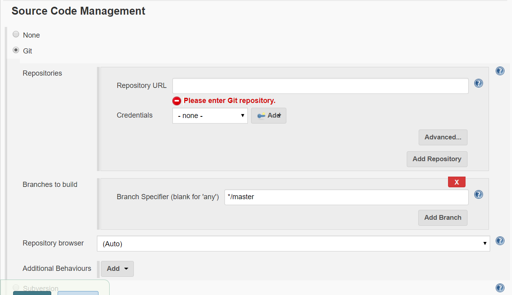
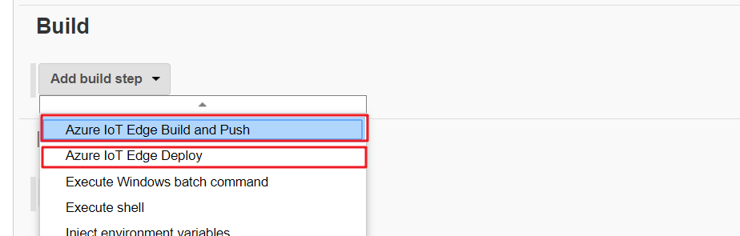

# Azure IoT Edge Jenkins extension bugbash

## Time
It will cost 15-20 minutes to complete this bug bash.

## Issues
Please log issue on [Github](https://github.com/Microsoft/azure-iot-edge-jenkins-plugin/issues)

## Prerequisites
1. You already have a Git repo that contains an Edge solution.

2. Create an Azure Service Principal through [Azure CLI](https://docs.microsoft.com/en-us/cli/azure/create-an-azure-service-principal-azure-cli?toc=%2fazure%2fazure-resource-manager%2ftoc.json) or [Azure portal](https://docs.microsoft.com/en-us/azure/azure-resource-manager/resource-group-create-service-principal-portal).

## Steps
1. Goto [http://msnow.org/jenkins](http://msnow.org/jenkins), login with username `vschinaiot`, password `#*******$`

3. Open Jenkins dashboard, go to Credentials, add a new `Microsoft Azure Service Principal` with the credential information you just created.

After you fill all the information, you can click `Verify Service Principal` to see if it works.

4. If you use common docker registry credential(like docker hub), you may also add a new `Username with password` credential.

5. Goto jenkins homepage, click `New Item`, enter an `item name` and choose `Freestyle project`.

6. Then you will goto project configuration page, check `Source Code Management` area, input the repo that contains an Edge solution.

7. Then you can add build steps to build and deploy. In `Build` section, click `Add build step`, then choose `Azure IoT Edge Build and Push`. Also add a `Azure IoT Edge Deploy` task.

8. Build and Push configuration. You can click `?` button on the right side of input box to check the detail explanation for the item.

* Set `Solution Root Path`, in most cases it's where deployment.template.json located.
* Set `Bypass modules`, it is the list of modules to bypass when building, use comma delimited list of modules. Example "ModuleA,ModuleB". You can leave this field empty to build all modules.
* Choose docker registry in `Docker Credential Configuration`.
  * For Azure Container Registry, you need to use the Azure Service Principal created above to authenticate.
  * For other types of registry(docker hub), you need to specify `Docker registry URL` and then a credential with type `Username with password`.

9. Deploy configuration.
* Set `Solution Root Path`, in most cases it's where deployment.template.json located.
* Choose Azure IoT Hub.
* Set deployment configurations. You can click `help` button after the input box to get detailed explanation of the item.

10. Click `Save` and then click `Build Now` in project dashboard.

11. Check if build succeeded. Please also have a check on IoT Hub portal to see if deployment is successfully applied to cloud.